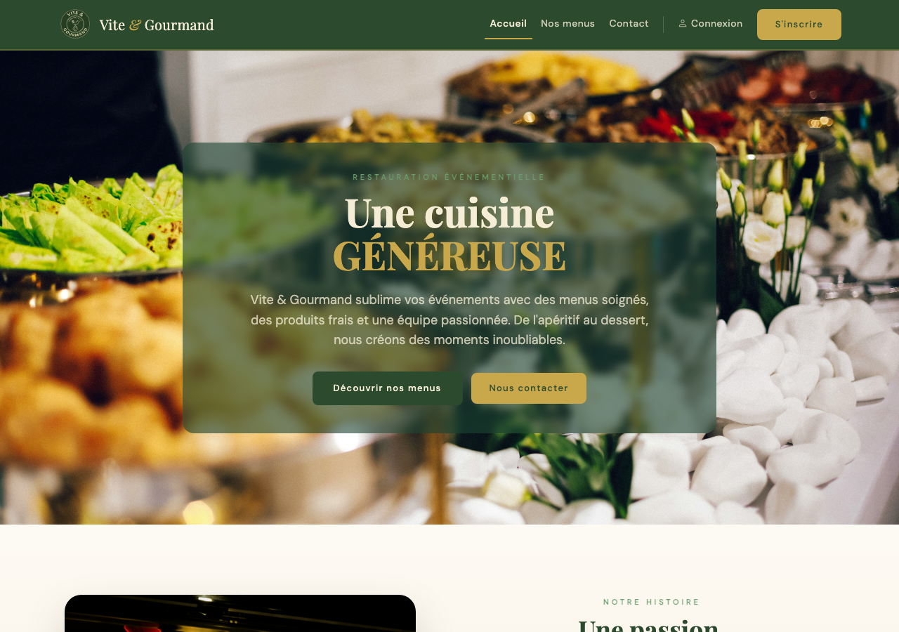
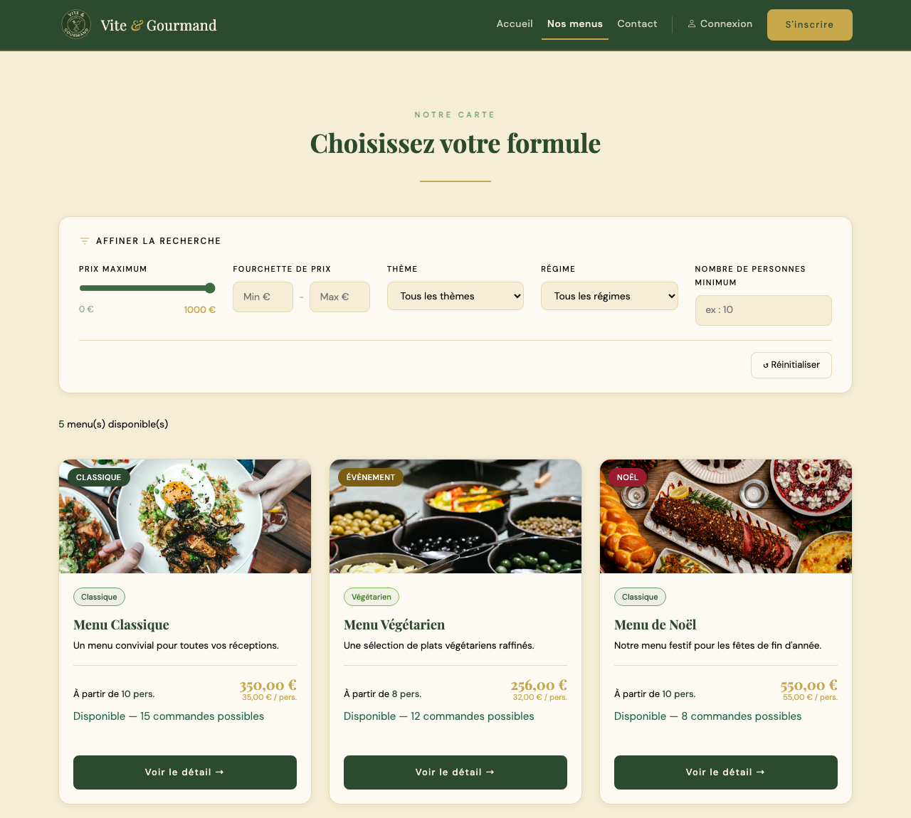
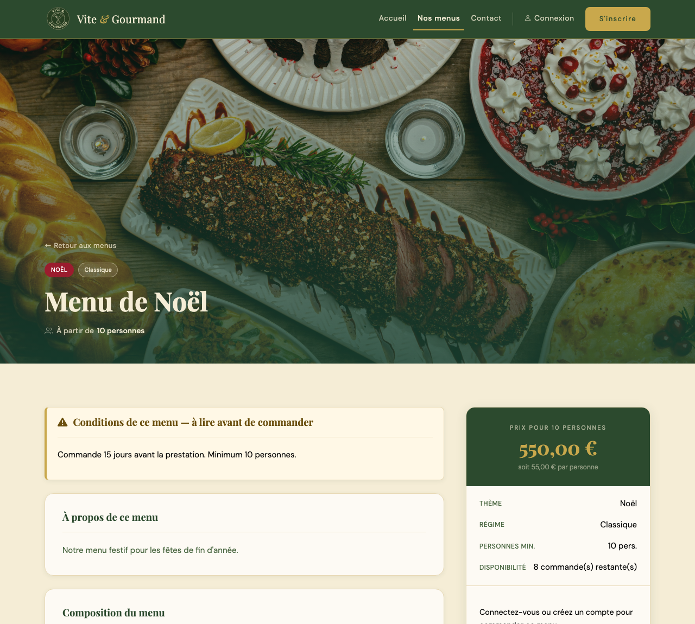
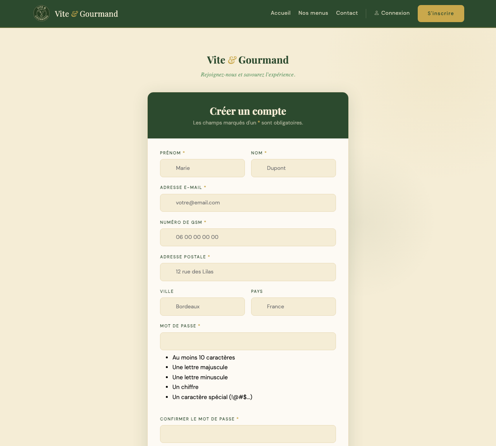
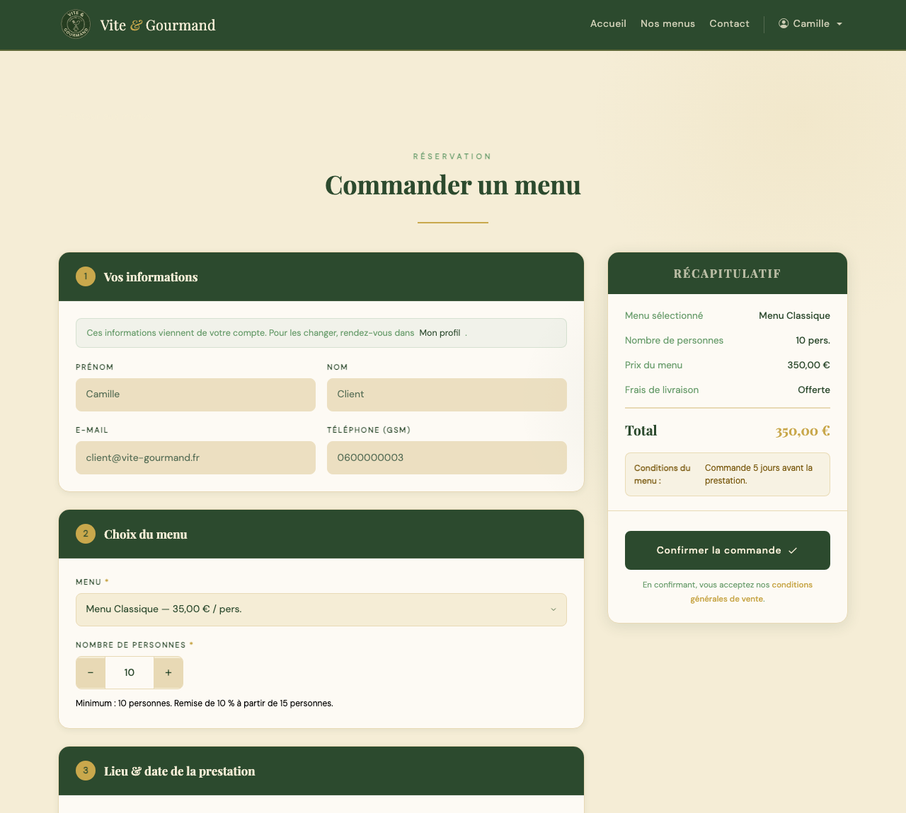
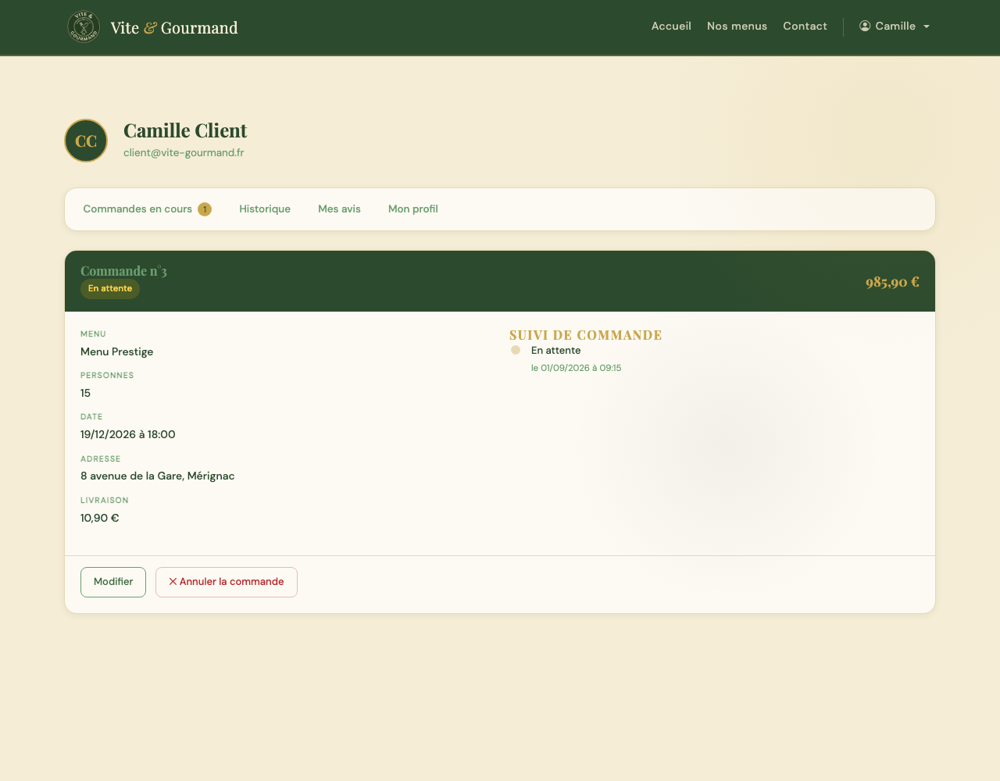
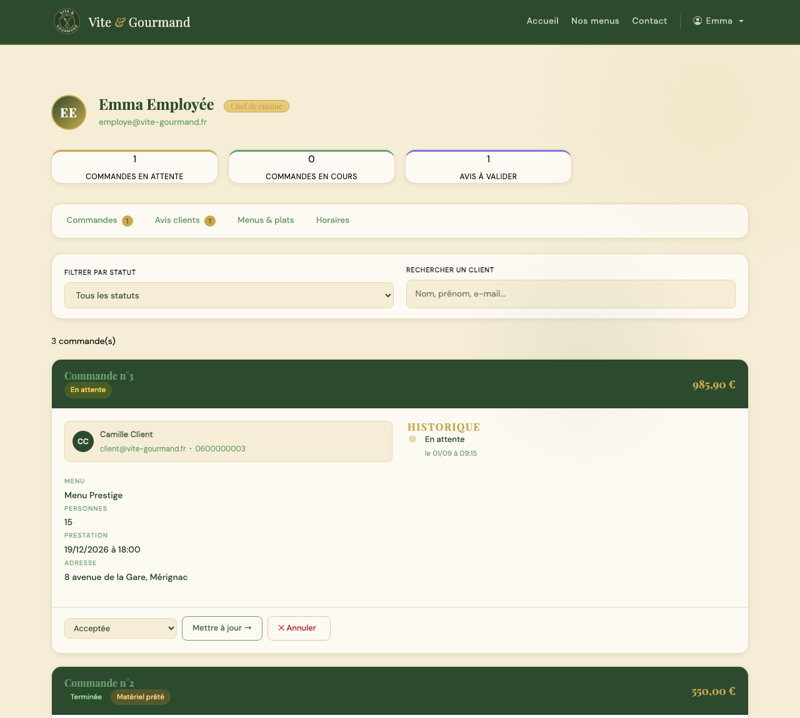
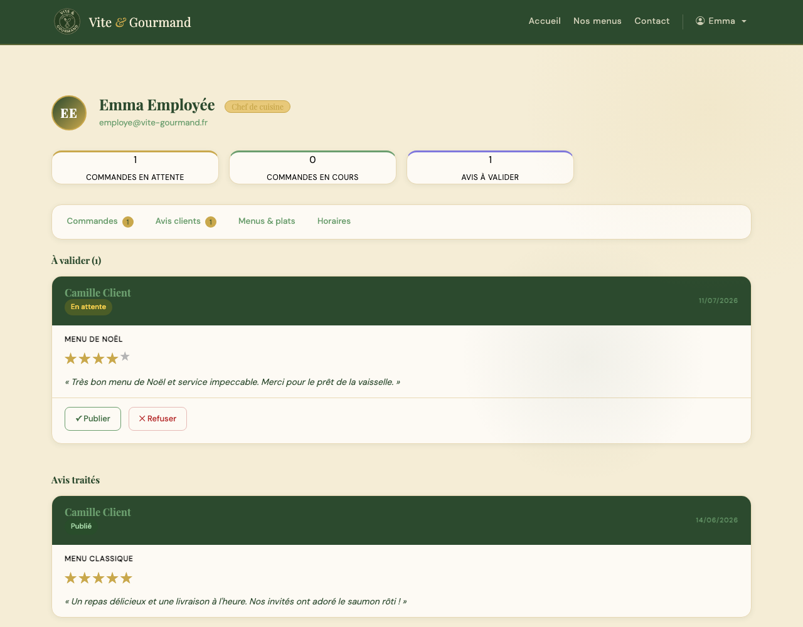
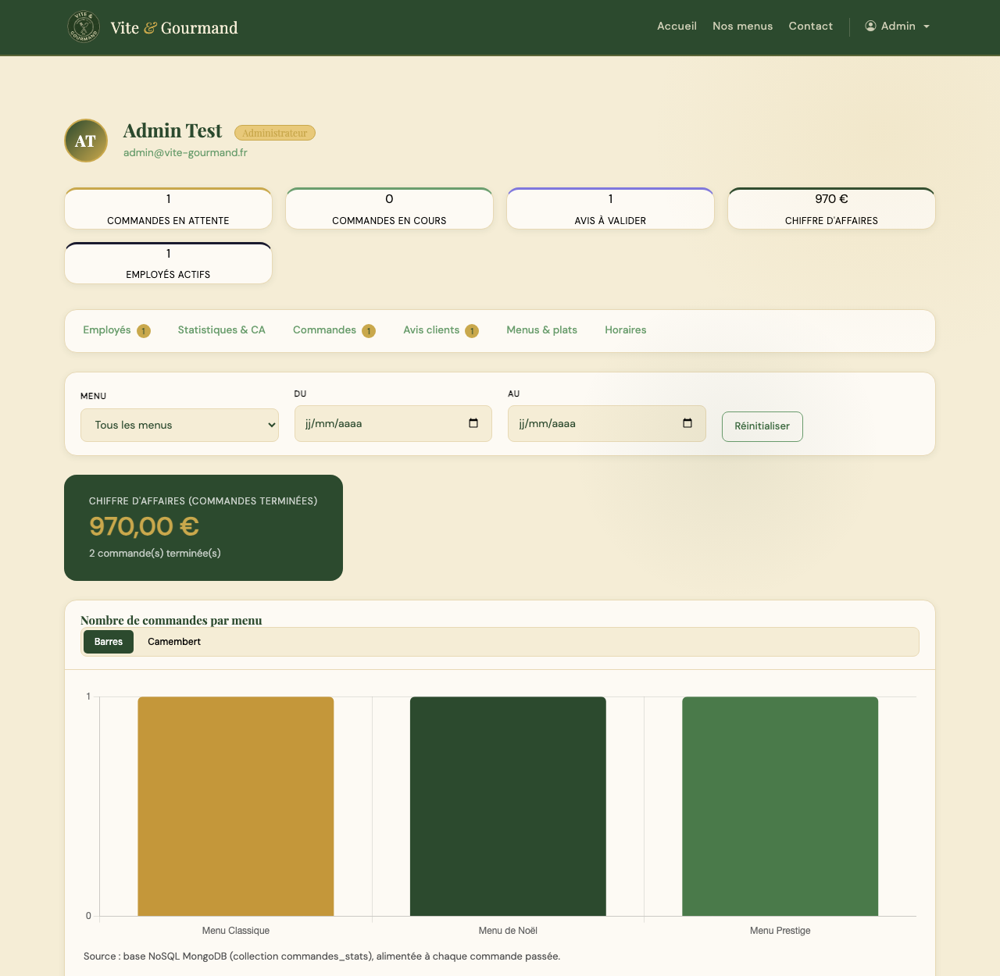

# Manuel d'utilisation

**Vite & Gourmand** est l'application web de Julie et José, traiteurs à Bordeaux depuis 25 ans.
Elle permet de découvrir et de commander leurs menus en ligne, et à l'équipe de gérer les commandes, le catalogue et les avis.

## 1. Accès et comptes de démonstration

- Application en ligne : **URL de production indiquée dans la copie à rendre**
- En local : http://localhost:8080 (voir le fichier README.md du dépôt)

| Profil | Identifiant (e-mail) | Mot de passe | Accès |
|---|---|---|---|
| Administrateur | `admin@vite-gourmand.fr` | `Admin@2026!` | Espace administrateur (+ tout l'espace employé) |
| Employé | `employe@vite-gourmand.fr` | `Employe@2026!` | Espace employé |
| Client | `client@vite-gourmand.fr` | `Client@2026!` | Commandes, suivi, avis, profil |

Les données de démonstration contiennent déjà : une commande terminée avec un avis publié, une commande terminée dont
l'avis attend d'être modéré, et une commande « en attente » à traiter.

## 2. Parcours visiteur

### Page d'accueil
Présentation de l'entreprise et de l'équipe, fonctionnement, et **avis clients validés** par l'équipe.
Le menu de navigation donne accès à l'accueil, aux menus, au contact et à la connexion. Le pied de page affiche
les **horaires du lundi au dimanche** ainsi que les liens vers les mentions légales et les CGV.

### Consulter et filtrer les menus
La page **Nos menus** présente chaque menu : titre, description, nombre minimum de personnes, prix et disponibilité.
Les filtres (prix maximum, fourchette de prix, thème, régime, nombre de personnes minimum) **actualisent la liste
immédiatement, sans rechargement de page**. Le bouton « Réinitialiser » efface tous les filtres.

### Détail d'un menu
Le bouton **Voir le détail** affiche toutes les informations : galerie photo, description, composition par
catégorie (entrée, plat, dessert) avec les **allergènes** de chaque plat, thème, régime et stock.
Les **conditions du menu** (délai de commande, conservation…) sont affichées en premier, dans un encadré bien visible.
Un visiteur non connecté est invité à se connecter ou à créer un compte pour commander.

### Créer un compte / se connecter
- **S'inscrire** : nom, prénom, numéro de GSM, e-mail, adresse postale et mot de passe (10 caractères minimum avec une
  majuscule, une minuscule, un chiffre et un caractère spécial ; les règles se cochent pendant la saisie).
  Un e-mail de bienvenue est envoyé automatiquement.
- **Connexion** : e-mail et mot de passe. En cas d'oubli, le lien **Mot de passe oublié ?** envoie par e-mail un lien
  de réinitialisation valable une heure.

### Contact
Le formulaire demande un titre, un message et l'e-mail du visiteur ; la demande est transmise par e-mail à l'entreprise.

## 3. Parcours client (compte `client@vite-gourmand.fr`)

### Commander un menu
Depuis le détail d'un menu, **Commander ce menu** ouvre le formulaire avec le menu déjà sélectionné.

1. Les informations du client (nom, prénom, e-mail, GSM) sont reprises du compte.
2. Choisir le **nombre de personnes** (au moins le minimum du menu).
3. Indiquer la **date, l'heure et l'adresse** de la prestation. Hors de Bordeaux, indiquer la distance en kilomètres.
4. Cocher le **prêt de matériel** si besoin (à restituer sous 10 jours ouvrés, sinon 600 € de frais).

Le **récapitulatif** se met à jour en direct : prix du menu, **réduction de 10 %** dès 5 personnes au-delà du minimum,
**frais de livraison** (offerts à Bordeaux, sinon 5 € + 0,59 €/km) et total. Après validation, un e-mail de confirmation est envoyé.

### Mon espace
- **Commandes en cours** : détail et **suivi** (chaque statut avec sa date et son heure). Tant que l'équipe n'a pas
  accepté la commande, le client peut la **modifier** (tout sauf le menu ; le prix est recalculé) ou l'**annuler**.
- **Historique** : commandes terminées ou annulées.
- **Mes avis** : pour chaque commande terminée, une note de 1 à 5 et un commentaire. L'avis apparaît sur l'accueil après validation.
- **Mon profil** : modification des informations personnelles, suppression du compte.

## 4. Parcours employé (compte `employe@vite-gourmand.fr`)

### Commandes
Liste de toutes les commandes, **filtrable par statut et par client**. Pour chaque commande : coordonnées du client
(e-mail et téléphone cliquables), détail et historique.

- **Mettre à jour** propose uniquement le statut suivant autorisé : acceptée → en préparation → en cours de livraison →
  livrée → en attente du retour de matériel (si du matériel a été prêté) → terminée.
  Des e-mails automatiques sont envoyés au client au passage en « retour de matériel » et en « terminée ».
- **Annuler** : obligatoire de préciser le **mode de contact** utilisé avec le client (appel GSM ou e-mail) et le **motif**.

### Avis clients
Les avis en attente peuvent être **publiés** ou **refusés** d'un clic, sans rechargement de la page.
Seuls les avis publiés apparaissent sur la page d'accueil.

### Menus & plats, horaires
- **Menus** : créer, modifier (titre, description, conditions, thème, régime, prix, minimum de personnes, stock,
  photos), désactiver ou supprimer. Un menu déjà commandé ne peut pas être supprimé : il faut le désactiver.
- **Plats** : créer, modifier, supprimer ; rattacher un plat à **un ou plusieurs menus** et cocher ses allergènes.
- **Horaires** : ouvrir ou fermer chaque jour et régler les heures ; le pied de page est mis à jour immédiatement.

## 5. Parcours administrateur (compte `admin@vite-gourmand.fr`)

L'administrateur dispose de tout l'espace employé, plus :

- **Employés** : créer un compte employé (e-mail = identifiant, mot de passe choisi par l'administrateur).
  L'employé reçoit un e-mail qui **ne contient pas son mot de passe**. Un compte peut être **désactivé** (départ de
  l'entreprise) puis réactivé. Il n'est pas possible de créer un compte administrateur depuis l'application.
- **Statistiques & CA** : graphique du **nombre de commandes par menu** (données issues de la base NoSQL MongoDB),
  en barres ou en camembert, et **chiffre d'affaires** des commandes terminées, **filtrable par menu et par période**.
  Les résultats se mettent à jour sans rechargement.

## 6. Accessibilité

- Navigation complète au clavier : lien « Aller au contenu principal », onglets utilisables avec les flèches.
- Champs de formulaire tous associés à un libellé, messages d'erreur et mises à jour annoncés aux lecteurs d'écran.
- Contrastes de couleurs conformes et site utilisable sur mobile.
