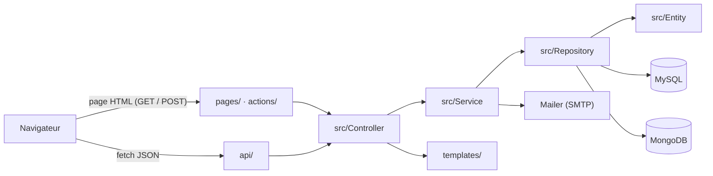

# Réflexions initiales et choix techniques

## 1. Analyse du besoin

Vite & Gourmand (Julie et José, traiteur à Bordeaux depuis 25 ans) envoie aujourd'hui ses menus par e-mail à ses habitués.
L'application doit :

- présenter l'entreprise et les avis clients validés ;
- rendre les menus consultables par tous, avec des filtres qui actualisent la liste **sans rechargement** ;
- permettre aux clients de commander, suivre, modifier et noter leurs commandes ;
- donner aux employés un espace de gestion (commandes, menus, plats, horaires, avis) ;
- donner à l'administrateur les comptes employés et des statistiques issues d'une **base NoSQL** ;
- être **déployée**, **sécurisée** et **accessible (RGAA)**.

Les seules technologies imposées sont une base relationnelle et une base non relationnelle.

## 2. Choix de la stack

| Besoin | Choix | Justification | Alternatives étudiées |
|---|---|---|---|
| Back-end | **PHP 8.2 sans framework, architecture MVC en couches** | Maîtriser les fondamentaux attendus par le titre (POO, PDO, sessions, sécurité) sans « magie » de framework ; hébergement simple (Apache) | Symfony / Laravel : plus productifs sur un gros projet, mais masquent les mécanismes que l'ECF doit démontrer |
| Accès aux données | **PDO + repositories** | Requêtes préparées natives (anti-injection), portabilité MySQL / MariaDB, retour d'objets entité | ORM (Doctrine) : surdimensionné pour une vingtaine de tables |
| Base relationnelle | **MySQL 8** | Données très structurées et liées (utilisateurs, menus, commandes) : clés étrangères, transactions, contraintes | PostgreSQL : équivalent ici ; MySQL est mieux supporté par phpMyAdmin et les hébergeurs visés |
| Base NoSQL | **MongoDB 7** | Statistiques de commandes : un document par commande, agrégé par menu et par période (`$match`, `$group`) sans jointure ; historique conservé même si un menu change | Redis : adapté au cache, pas aux agrégations ; tout en MySQL : ne répond pas à l'exigence NoSQL |
| Front-end | **HTML 5, CSS (Bootstrap 5), JavaScript natif** | Pages rendues par le serveur (référencement, accessibilité, fonctionnement sans JavaScript), enrichies par `fetch` là où l'interactivité compte | React / Vue : lourds pour quelques zones dynamiques ; jQuery / Axios : `fetch` est natif |
| Échanges asynchrones | **API JSON (`api/*.php`) + `fetch`** | Filtres des menus, prix de la commande, modération des avis et statistiques sans rechargement ; les règles restent côté serveur | Calculs en JavaScript seul : règles dupliquées et contournables |
| Graphiques | **Chart.js** | Léger, via CDN, graphiques en barres et camembert | D3.js : plus complexe pour ce besoin |
| E-mails | **PHPMailer (SMTP)** | Envoi fiable, configuration par variables d'environnement ; **Mailpit** en local | Fonction `mail()` : dépend de la configuration du serveur |
| Environnement | **Docker / Docker Compose** | Même environnement pour tous les développeurs et en production ; installation en une commande | WAMP / MAMP : versions différentes selon les postes |
| Hébergement | **Railway** | Déploiement direct du Dockerfile depuis GitHub, bases MySQL et MongoDB managées, HTTPS | Heroku : plus d'offre gratuite ; fly.io : volumes plus complexes ; Vercel : pas de PHP persistant |
| Gestion de projet | **Notion** (tableau Kanban) | Suivi des fonctionnalités par statut, documentation au même endroit | Trello, Jira |
| Maquettes | **Figma** | Wireframes et mockups ordinateur / mobile, partage de la charte graphique | Adobe XD |

## 3. Architecture retenue

- **Un point d'entrée par page** (`pages/menus.php`…) : les URL restent simples et lisibles, sans routeur.
- **Contrôleurs légers** : ils ne font que lire la requête, contrôler les droits et le jeton CSRF, puis déléguer.
- **Services** : toute la logique métier (voir le détail dans le diagramme de classes).
- **Repositories** : tout le SQL, qui renvoie des objets entité, jamais des tableaux bruts.
- **Templates** : uniquement de l'affichage ; aucune requête SQL.
- **Autoload PSR-4** (Composer) : chaque classe `App\...` est chargée automatiquement depuis `src/`.

Cette organisation permet de modifier une règle (ex. le tarif kilométrique) à un seul endroit (`CommandeService`),
et de réutiliser le même code pour la page HTML et pour l'API JSON.
