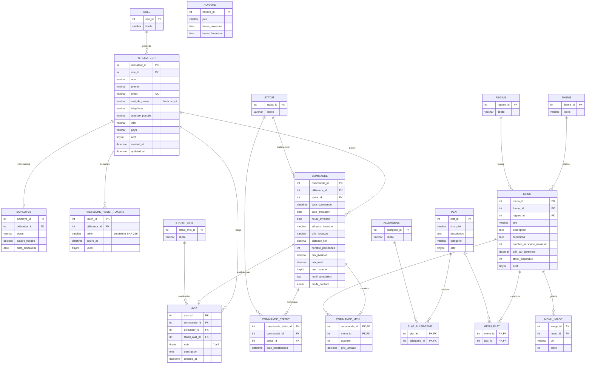

# Modèle conceptuel de données — Vite & Gourmand

Le modèle a été conçu à partir du cahier des charges, avant le développement. Il est implémenté dans MySQL par
`database/create.sql` (structure) et `database/seed.sql` (données de référence et de démonstration).

## 1. Entités et associations (notation Merise)

| Association | Entité A | Card. A | Entité B | Card. B | Données portées |
|---|---|---|---|---|---|
| **possède** | UTILISATEUR | 1,1 | ROLE | 0,n | |
| **est employé** | EMPLOYE | 1,1 | UTILISATEUR | 0,1 | |
| **demande** (réinitialisation) | JETON_REINITIALISATION | 1,1 | UTILISATEUR | 0,n | |
| **passe** | COMMANDE | 1,1 | UTILISATEUR | 0,n | |
| **contient** | COMMANDE | 1,n | MENU | 0,n | quantité, prix unitaire |
| **est dans l'état** (actuel) | COMMANDE | 1,1 | STATUT | 0,n | |
| **a traversé** (historique) | COMMANDE | 1,n | STATUT | 0,n | date de modification |
| **appartient à** | MENU | 1,1 | THEME | 0,n | |
| **respecte** | MENU | 1,1 | REGIME | 0,n | |
| **illustre** | IMAGE | 1,1 | MENU | 0,n | |
| **compose** | MENU | 0,n | PLAT | 0,n | |
| **contient** (allergène) | PLAT | 0,n | ALLERGENE | 0,n | |
| **évalue** | AVIS | 1,1 | COMMANDE | 0,1 | |
| **rédige** | AVIS | 1,1 | UTILISATEUR | 0,n | |
| **est modéré** | AVIS | 1,1 | STATUT_AVIS | 0,n | |

`HORAIRE` est une entité indépendante (un enregistrement par jour de la semaine).

Choix de conception :

- **Un plat peut appartenir à plusieurs menus** (association n,n `compose`), comme le demande le cahier des charges.
- **Le statut actuel est stocké dans la commande**, et chaque changement est aussi historisé dans `commande_statut` :
  on affiche rapidement le statut courant, et le client dispose du suivi complet (statut + date et heure).
- **Le prix unitaire est copié dans `commande_menu`** au moment de la commande : si le prix du menu change ensuite,
  les commandes passées gardent leur prix réel.
- **Les rôles, statuts, thèmes et régimes sont des tables de référence** : on peut en ajouter sans modifier le code
  (le cahier des charges permet d'enrichir les régimes).
- **Les jetons de réinitialisation ne sont stockés que sous forme d'empreinte SHA-256.**

## 2. Modèle physique (MySQL)



## 3. Intégrité des données

- **Clés étrangères** sur toutes les relations (moteur InnoDB).
- **`ON DELETE CASCADE`** pour les données qui n'ont pas de sens seules : images et liaisons d'un menu, allergènes d'un plat,
  historique d'une commande, jetons d'un utilisateur.
- **Pas de cascade** entre commande, utilisateur et menu : on ne peut pas supprimer un menu déjà commandé (il faut le
  désactiver), et un compte client supprimé est anonymisé pour conserver les commandes (obligations comptables).
- Contrainte `CHECK (note BETWEEN 1 AND 5)` sur les avis, `UNIQUE` sur l'e-mail des utilisateurs.

## 4. Données non relationnelles (MongoDB)

Base `vite_gourmand`, collection `commandes_stats`. Un document est ajouté à chaque commande :

```json
{
  "commande_id": 12,
  "menu_id": 3,
  "menu_titre": "Menu de Noël",
  "prix_total": 550.0,
  "date": { "$date": "2026-09-12T09:30:00Z" }
}
```

L'espace administrateur les agrège (`$match` sur la période, puis `$group` par menu) pour afficher le nombre de
commandes par menu dans un graphique. Ce modèle « journal d'événements » s'agrège simplement sans jointure, et
l'historique statistique reste intact même si un menu est modifié ou supprimé dans MySQL.
