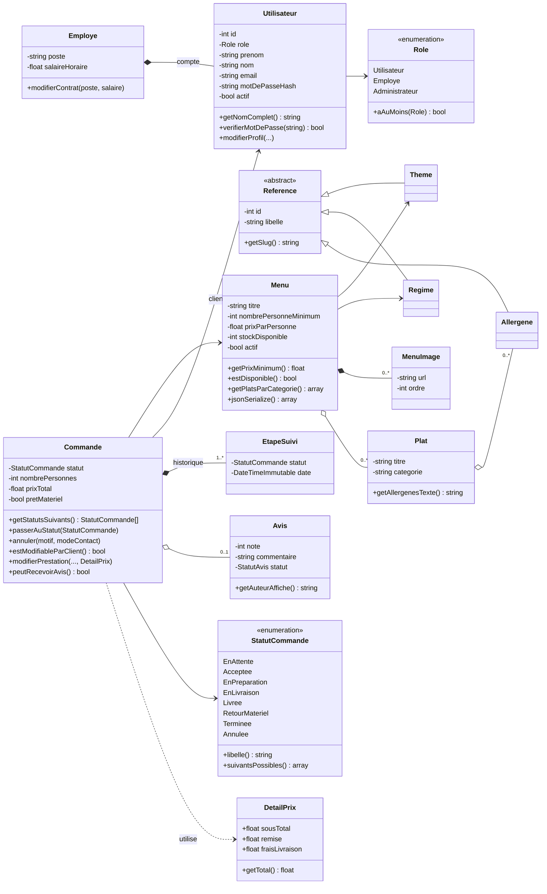
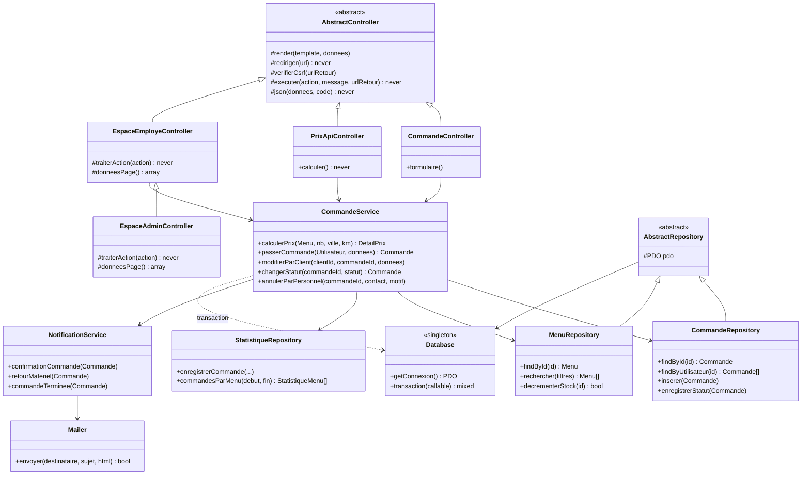

# Diagramme de classes — architecture en couches

L'application est découpée en couches qui ont chacune une seule responsabilité :

| Couche | Dossier | Rôle |
|---|---|---|
| Point d'entrée | `pages/`, `actions/`, `api/` | Charge `src/bootstrap.php` puis appelle un contrôleur (3 lignes) |
| Contrôleur | `src/Controller` | Lit la requête, vérifie les droits et le jeton CSRF, appelle un service, choisit la réponse (page, redirection, JSON) |
| Service | `src/Service` | Logique métier : calcul du prix, règles de commande, e-mails, statistiques |
| Repository | `src/Repository` | Accès aux données (SQL préparé, MongoDB), transforme les lignes en objets entité |
| Entité | `src/Entity`, `src/Enum` | Objets métier et leurs règles (ex : une commande refuse une transition de statut interdite) |
| Vue | `templates/` | HTML uniquement, alimenté par les données préparées par le contrôleur |

Une dépendance ne va jamais « vers le haut » : un repository ne connaît pas les services, une entité ne connaît pas la base de données.

## 1. Modèle métier (entités)

## 2. Couches : exemple de la commande

Principes de programmation orientée objet appliqués :

- **Encapsulation** : propriétés privées, modifiées uniquement par des méthodes métier qui contrôlent les règles
  (`Commande::passerAuStatut()` lève une `MetierException` si la transition est interdite).
- **Héritage** : `AbstractController`, `AbstractRepository`, `Reference` (Theme, Regime, Allergene) ;
  l'espace administrateur hérite de l'espace employé et n'ajoute que ses actions propres.
- **Polymorphisme** : `EspaceAdminController::traiterAction()` redéfinit la méthode parente et délègue à `parent::traiterAction()`
  pour les actions communes.
- **Injection de dépendances** : chaque service reçoit ses repositories dans son constructeur (valeurs par défaut),
  ce qui permet de les remplacer pour les tests.
- **Enums PHP 8.1** : les statuts et rôles sont des types, pas des nombres « magiques » dispersés dans le code.
