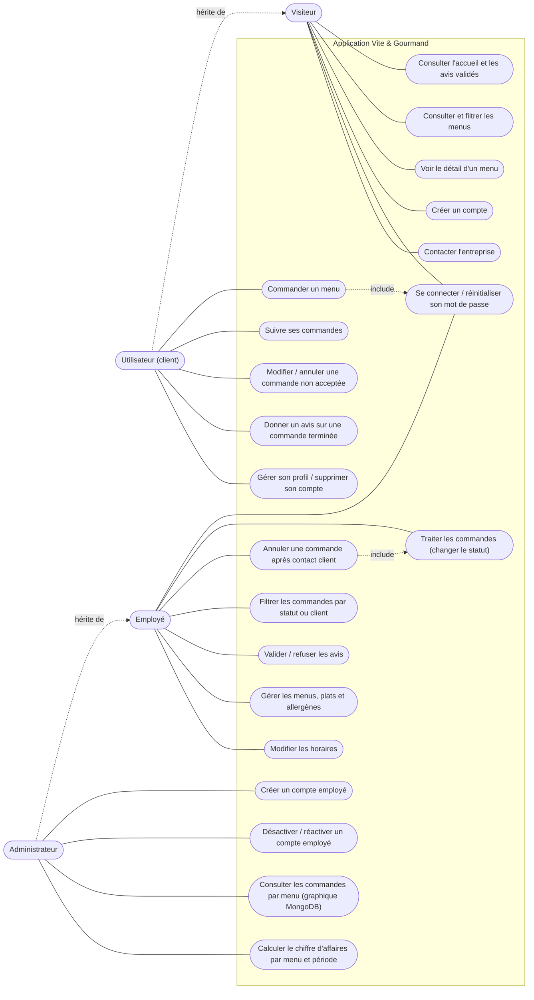

# Diagramme de cas d'utilisation

Quatre acteurs, avec héritage des droits : un **utilisateur** connecté peut faire tout ce que fait un **visiteur** ;
l'**administrateur** peut faire tout ce que fait un **employé**.

## Règles associées

| Cas d'utilisation | Règles de gestion |
|---|---|
| Créer un compte | Nom, prénom, GSM, e-mail, adresse postale obligatoires ; mot de passe ≥ 10 caractères avec majuscule, minuscule, chiffre et caractère spécial ; rôle « utilisateur » ; e-mail de bienvenue |
| Commander un menu | Connexion obligatoire (redirection vers la connexion puis retour à la commande) ; minimum de personnes du menu ; −10 % dès 5 personnes au-delà du minimum ; livraison gratuite à Bordeaux sinon 5 € + 0,59 €/km ; stock décrémenté ; e-mail de confirmation |
| Modifier / annuler | Possible tant que la commande est « en attente » ; tout est modifiable sauf le menu ; une annulation libère le stock |
| Donner un avis | Commande terminée, une seule fois ; note de 1 à 5 et commentaire ; visible sur l'accueil après validation |
| Traiter les commandes | Transitions imposées : en attente → acceptée → en préparation → en cours de livraison → livrée → (retour de matériel si prêt) → terminée ; e-mails automatiques au retour de matériel (600 € après 10 jours ouvrés) et à la fin |
| Annuler (employé) | Mode de contact (GSM ou e-mail) et motif obligatoires ; client prévenu par e-mail |
| Créer un compte employé | Réservé à l'administrateur ; l'e-mail envoyé ne contient pas le mot de passe ; impossible de créer un administrateur |
