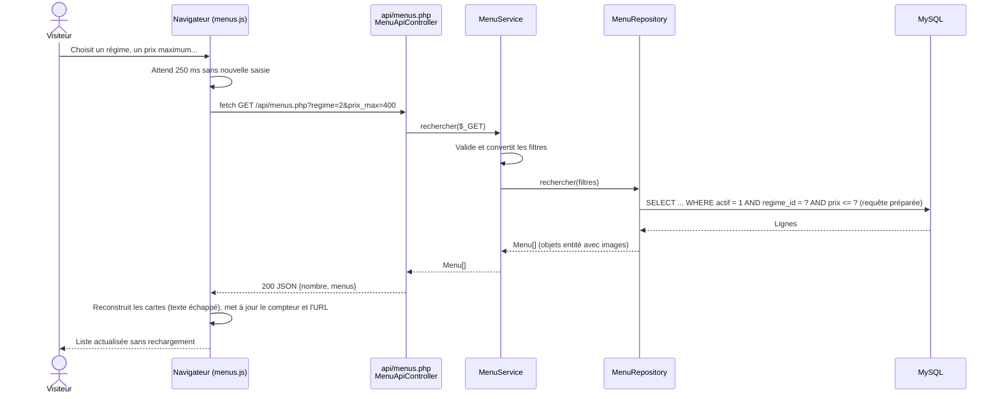
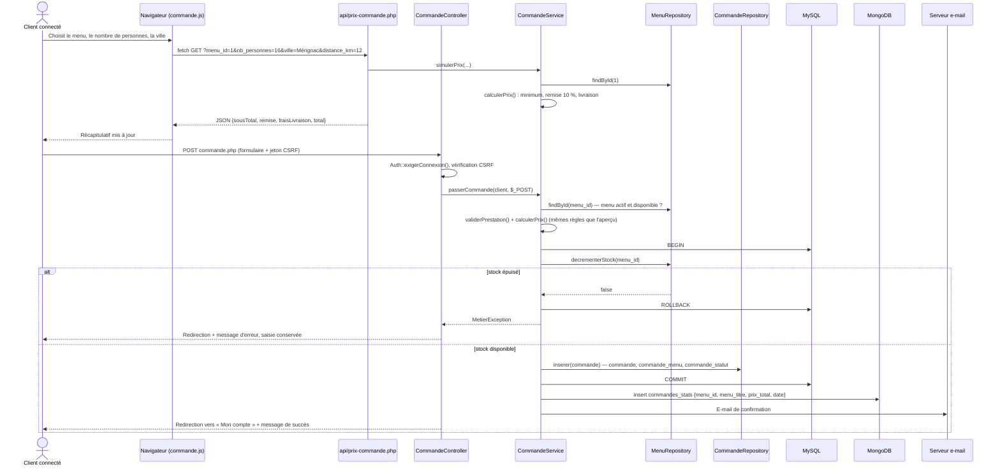
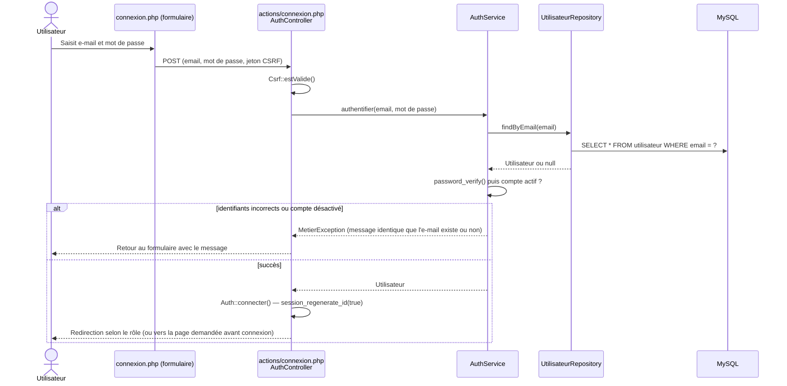
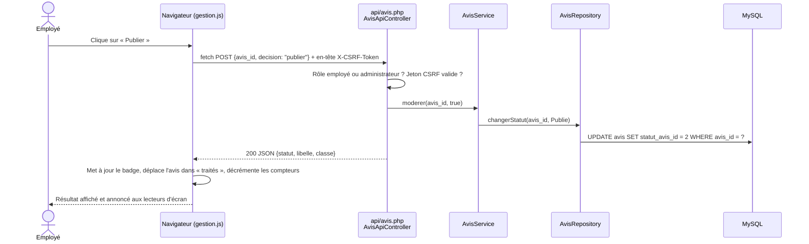

# Diagrammes de séquence

## 1. Filtrer les menus (appel asynchrone fetch)

```mermaid
sequenceDiagram
    actor V as Visiteur
    participant N as Navigateur (menus.js)
    participant A as api/menus.php<br/>MenuApiController
    participant S as MenuService
    participant R as MenuRepository
    participant DB as MySQL

    V->>N: Choisit un régime, un prix maximum...
    N->>N: Attend 250 ms sans nouvelle saisie
    N->>A: fetch GET /api/menus.php?regime=2&prix_max=400
    A->>S: rechercher($_GET)
    S->>S: Valide et convertit les filtres
    S->>R: rechercher(filtres)
    R->>DB: SELECT ... WHERE actif = 1 AND regime_id = ? AND prix <= ? (requête préparée)
    DB-->>R: Lignes
    R-->>S: Menu[] (objets entité avec images)
    S-->>A: Menu[]
    A-->>N: 200 JSON {nombre, menus}
    N->>N: Reconstruit les cartes (texte échappé), met à jour le compteur et l'URL
    N-->>V: Liste actualisée sans rechargement
```

## 2. Passer une commande

```mermaid
sequenceDiagram
    actor C as Client connecté
    participant N as Navigateur (commande.js)
    participant P as api/prix-commande.php
    participant CC as CommandeController
    participant CS as CommandeService
    participant MR as MenuRepository
    participant CR as CommandeRepository
    participant DB as MySQL
    participant MG as MongoDB
    participant M as Serveur e-mail

    C->>N: Choisit le menu, le nombre de personnes, la ville
    N->>P: fetch GET ?menu_id=1&nb_personnes=16&ville=Mérignac&distance_km=12
    P->>CS: simulerPrix(...)
    CS->>MR: findById(1)
    CS->>CS: calculerPrix() : minimum, remise 10 %, livraison
    P-->>N: JSON {sousTotal, remise, fraisLivraison, total}
    N-->>C: Récapitulatif mis à jour

    C->>CC: POST commande.php (formulaire + jeton CSRF)
    CC->>CC: Auth::exigerConnexion(), vérification CSRF
    CC->>CS: passerCommande(client, $_POST)
    CS->>MR: findById(menu_id) — menu actif et disponible ?
    CS->>CS: validerPrestation() + calculerPrix() (mêmes règles que l'aperçu)
    CS->>DB: BEGIN
    CS->>MR: decrementerStock(menu_id)
    alt stock épuisé
        MR-->>CS: false
        CS->>DB: ROLLBACK
        CS-->>CC: MetierException
        CC-->>C: Redirection + message d'erreur, saisie conservée
    else stock disponible
        CS->>CR: inserer(commande) — commande, commande_menu, commande_statut
        CS->>DB: COMMIT
        CS->>MG: insert commandes_stats {menu_id, menu_titre, prix_total, date}
        CS->>M: E-mail de confirmation
        CC-->>C: Redirection vers « Mon compte » + message de succès
    end
```

## 3. Connexion

```mermaid
sequenceDiagram
    actor U as Utilisateur
    participant F as connexion.php (formulaire)
    participant AC as actions/connexion.php<br/>AuthController
    participant AS as AuthService
    participant UR as UtilisateurRepository
    participant DB as MySQL

    U->>F: Saisit e-mail et mot de passe
    F->>AC: POST (email, mot de passe, jeton CSRF)
    AC->>AC: Csrf::estValide()
    AC->>AS: authentifier(email, mot de passe)
    AS->>UR: findByEmail(email)
    UR->>DB: SELECT * FROM utilisateur WHERE email = ?
    UR-->>AS: Utilisateur ou null
    AS->>AS: password_verify() puis compte actif ?
    alt identifiants incorrects ou compte désactivé
        AS-->>AC: MetierException (message identique que l'e-mail existe ou non)
        AC-->>U: Retour au formulaire avec le message
    else succès
        AS-->>AC: Utilisateur
        AC->>AC: Auth::connecter() — session_regenerate_id(true)
        AC-->>U: Redirection selon le rôle (ou vers la page demandée avant connexion)
    end
```

## 4. Modérer un avis (appel asynchrone fetch)

```mermaid
sequenceDiagram
    actor E as Employé
    participant N as Navigateur (gestion.js)
    participant A as api/avis.php<br/>AvisApiController
    participant S as AvisService
    participant R as AvisRepository
    participant DB as MySQL

    E->>N: Clique sur « Publier »
    N->>A: fetch POST {avis_id, decision: "publier"} + en-tête X-CSRF-Token
    A->>A: Rôle employé ou administrateur ? Jeton CSRF valide ?
    A->>S: moderer(avis_id, true)
    S->>R: changerStatut(avis_id, Publie)
    R->>DB: UPDATE avis SET statut_avis_id = 2 WHERE avis_id = ?
    A-->>N: 200 JSON {statut, libelle, classe}
    N->>N: Met à jour le badge, déplace l'avis dans « traités », décrémente les compteurs
    N-->>E: Résultat affiché et annoncé aux lecteurs d'écran
```
