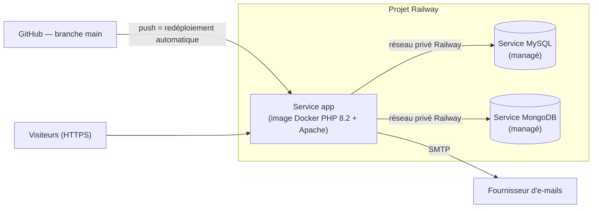

# Documentation du déploiement

L'application est déployée sur **Railway** à partir du `Dockerfile` du dépôt GitHub.
Cette procédure permet à un tiers de reproduire la mise en ligne de zéro.

## 1. Architecture de production



## 2. Préparation de l'image (`Dockerfile`)

1. Image officielle `php:8.2-apache`, extensions `pdo_mysql` (MySQL) et `mongodb` (installée par PECL).
2. Un seul module MPM Apache activé (`mpm_prefork`, requis par le module PHP) — voir « Problèmes rencontrés ».
3. `display_errors = Off`, erreurs envoyées sur la sortie d'erreur (lisibles dans les logs Railway).
4. Limites d'upload augmentées (photos des menus).
5. `composer install --no-dev --optimize-autoloader` : dépendances et autoload des classes.
6. `docker-entrypoint.sh` : Railway impose le port d'écoute via la variable `$PORT` ; le script l'applique à Apache au démarrage.
7. `.dockerignore` : le fichier `.env`, le dossier `.git` et la documentation ne sont pas copiés dans l'image.

## 3. Étapes de mise en ligne

### Étape 1 — Créer le projet et les bases de données
1. Se connecter sur https://railway.com avec son compte GitHub.
2. **New Project → Deploy from GitHub repo** → choisir `Carlitaalt/vite-et-gourmand`. Railway détecte le `Dockerfile`.
3. Dans le projet : **+ Create → Database → MySQL**, puis **+ Create → Database → MongoDB**.

### Étape 2 — Variables d'environnement du service app
Onglet **Variables** du service de l'application (les références `${{...}}` sont résolues par Railway) :

| Variable | Valeur |
|---|---|
| `DB_HOST` | `${{MySQL.MYSQLHOST}}` |
| `DB_PORT` | `${{MySQL.MYSQLPORT}}` |
| `DB_NAME` | `${{MySQL.MYSQLDATABASE}}` |
| `DB_USER` | `${{MySQL.MYSQLUSER}}` |
| `DB_PASSWORD` | `${{MySQL.MYSQLPASSWORD}}` |
| `MONGO_URI` | `${{MongoDB.MONGO_URL}}` |
| `MONGO_DB` | `vite_gourmand` |
| `APP_URL` | URL publique de l'application (étape 4) |
| `MAIL_HOST`, `MAIL_PORT`, `MAIL_USER`, `MAIL_PASSWORD`, `MAIL_ENCRYPTION`, `MAIL_FROM`, `MAIL_CONTACT` | Identifiants du fournisseur d'e-mails |

Aucun de ces secrets n'apparaît dans le dépôt.

### Étape 3 — Initialiser les bases de données
Avec les informations de connexion publiques du service MySQL (onglet **Connect**) :

```bash
mysql -h <hôte public> -P <port public> -u root -p <base> < database/create.sql
mysql -h <hôte public> -P <port public> -u root -p <base> < database/seed.sql
mongosh "<MONGO_PUBLIC_URL>" database/mongo-init.js
```

### Étape 4 — Rendre l'application accessible
Service app → **Settings → Networking → Generate Domain** : Railway fournit une URL `https://…up.railway.app` avec certificat HTTPS.
Reporter cette URL dans la variable `APP_URL`.

### Étape 5 — Vérifier
- Onglet **Deployments** : le déploiement doit être « Active » ; **View logs** affiche les erreurs PHP éventuelles.
- Parcours de contrôle : accueil, filtres des menus, connexion avec les comptes de démonstration, commande, espace employé, statistiques administrateur.

### Déploiement continu
Chaque `git push` sur `main` déclenche une reconstruction et un redéploiement automatiques.
Le travail se fait sur `dev` et les branches `feature/…` ; seul un code testé est fusionné dans `main`.

## 4. Problèmes rencontrés et solutions

| Problème | Cause | Solution |
|---|---|---|
| `AH00534: More than one MPM loaded` au démarrage | L'image charge plusieurs modules MPM d'Apache | Suppression de tous les `mpm_*` puis activation de `mpm_prefork` seul (`Dockerfile` + `docker-entrypoint.sh`) |
| Application inaccessible | Railway attribue un port dynamique (`$PORT`) | Réécriture de `Listen` et du VirtualHost au démarrage (`docker-entrypoint.sh`) |
| Erreurs PHP visibles des visiteurs | Configuration par défaut de l'image | `display_errors = Off` + journalisation sur la sortie d'erreur |
| Photos téléversées perdues après un redéploiement | Le système de fichiers d'un conteneur est éphémère | Volume Railway monté sur `/var/www/html/assets/images/menus` |
